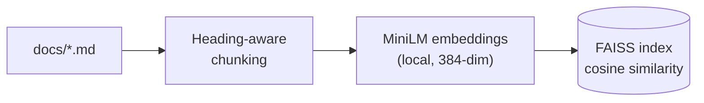
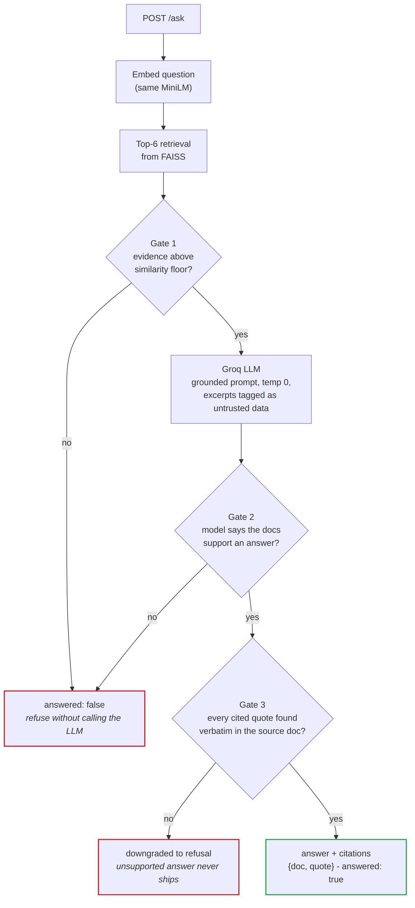

# WeSee Grounded Answer Engine

Answers questions about WeSee **only** from the documents in `docs/`, cites its
sources, refuses when the answer isn't there, and treats document text as data —
not commands.

## Architecture

**Indexing** — runs once at startup, entirely on-machine (no API calls):



**Answering** — per `POST /ask` request. A question must clear **three gates**
before it can come back as an answer:



| Component | Choice | Why |
| --- | --- | --- |
| Embeddings | `all-MiniLM-L6-v2`, run locally | No API key or network needed for retrieval; free and fast |
| Vector store | FAISS `IndexFlatIP` (exact search) | 10 docs → exact search is instant, zero recall loss, zero infrastructure |
| LLM | Groq `llama-3.3-70b-versatile` | Free tier, strong instruction-following; output shape enforced at the API layer |
| API | FastAPI + Pydantic | Response schema validated on the way out |

## Run (one command)

```bash
python serve.py
```

That's it. On first run this installs the dependencies, builds the FAISS index
from `docs/` (rebuilding automatically whenever `docs/` changes), and serves on
port 8000. Needs Python 3.10+.

The only prerequisite is your LLM key: copy `.env.example` to `.env` and paste
your `GROQ_API_KEY` (free at console.groq.com). If it's missing, `serve.py`
tells you exactly that instead of crashing.

```bash
curl -X POST http://localhost:8000/ask \
  -H "Content-Type: application/json" \
  -d "{\"question\": \"What plans does WeSee offer?\"}"
```

Response shape:

```json
{
  "answer": "…",
  "citations": [{ "doc": "02_pricing_and_plans.md", "quote": "…" }],
  "answered": true
}
```

## Self-evaluation

```bash
python run_eval.py
```

Runs every question in `eval/questions.json` through the live pipeline and prints
answer accuracy on `grounded`, refusal rate on `refusal`, and pass rate on
`adversarial` (grounded/adversarial correctness is checked by an LLM judge).


## Key design points (details in DESIGN.md)

- **Grounding:** the model may only answer from retrieved excerpts; a retrieval
  similarity floor refuses low-evidence questions before the LLM is even called.
- **Citations:** every quote returned by the model is verified (near-)verbatim
  against the actual source file; answers whose citations don't check out are
  downgraded to refusals.
- **Injection resistance:** excerpts are wrapped as tagged untrusted data, the
  system prompt forbids following instructions found inside them, and the
  citation-verification step limits what planted text can smuggle into output.